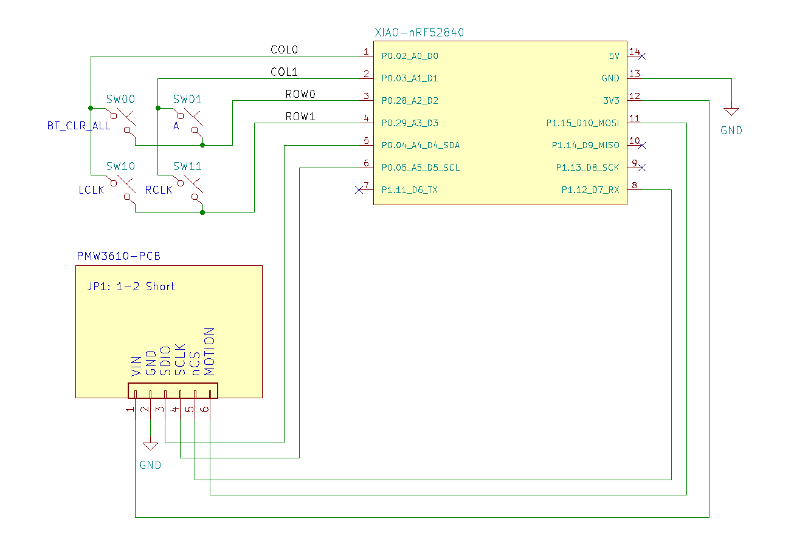

# ZMK sample project for pmw3610-pcb

This project is for checking PMW3610 Breakout board [pmw3610-pcb](https://github.com/hidsh/pmw3610-pcb).

- board: seeeduino_xiao_ble (XIAO nRF52840)
- shield: pmw3610-pcb
- modules: https://github.com/badjeff/zmk-pmw3610-driver

## Firmware Binary
You can download `zmk.uf2` from the [Releases](https://github.com/hidsh/zmk-pmw3610-pcb/releases).

## Connection to XIAO nRF52840


## Keybindings
||**COL0**|**COL1**|
|:---:|:---:|:---:|
|**ROW0**|`BT_CLR_ALL`<br>*Clear all Bluetooth profiles*|`a`|
|**ROW1**|`LCLK`<br>*Mouse L-Button*|`RCLK`<br>*Mouse R-Button*|

Refer to: [`pmw3610-pcb.keymap`](https://github.com/hidsh/zmk-pmw3610-pcb/blob/06a0b4f5abec8f8fc611582156476cd8058b6128/boards/shields/pmw3610-pcb/pmw3610-pcb.keymap#L12C1-L13C36)

## Local Build
### Prerequisites
- ZMK [Native Setup](https://zmk.dev/docs/development/local-toolchain/setup/native)
- [cyme](https://github.com/tuna-f1sh/cyme) (for flashing firmware)

### Setup
```
# clone this repo
cd ~/Downloads
git clone git@github.com:hidsh/zmk-pmw3610-pcb.git

# cd to your `zmk/app` folder
cd PATH/TO/zmk/app

# create a symlink from makefile
ln -s ~/Downloads/zmk-pmw3610-pcb/pmw3610-pcb.mk ./Makefile
```

### Build
```
# just `make` to build/flash firmware
make
```
As above, I prefer to build in the `app` folder to [Building from zmk-config Folder](https://zmk.dev/docs/development/local-toolchain/build-flash?build-opts=addonMcu#building-from-zmk-config-folder). 

## Links
- PMW3610 Breakout board [pmw3610-pcb](https://github.com/hidsh/pmw3610-pcb). Thanks to [siderakb](https://github.com/siderakb)!
- [BOOTH EC Page](https://zzz-kbd.booth.pm/items/7066618)
